# Phase 2: AI機能実装 - 検証レポート

## 実施内容

### 変更ファイル
- `app/routes/api.chat.ts` - isLocalDev分岐を削除（実AI応答のみ）
- `app/routes/api.documents.ts` - isLocalDev分岐を削除

### 検証結果

| 項目 | 結果 |
|------|------|
| ビルド | ✅ 成功 |
| E2Eテスト | ✅ 13件パス |
| AI応答 | ✅ 実際のWorkers AI応答を確認 |

## 証跡スクリーンショット

### 認証フロー
| 画像 | 説明 |
|------|------|
| 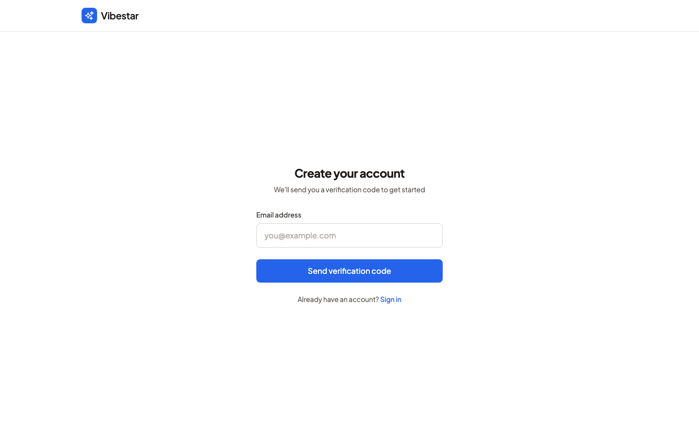 | サインアップページ |
| 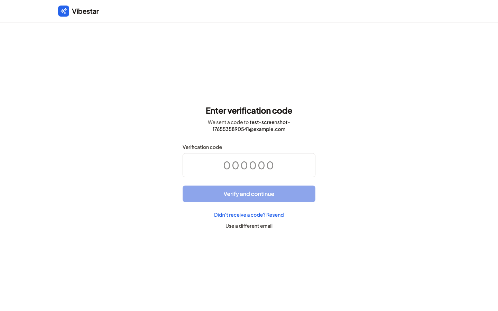 | OTP入力ページ |
| 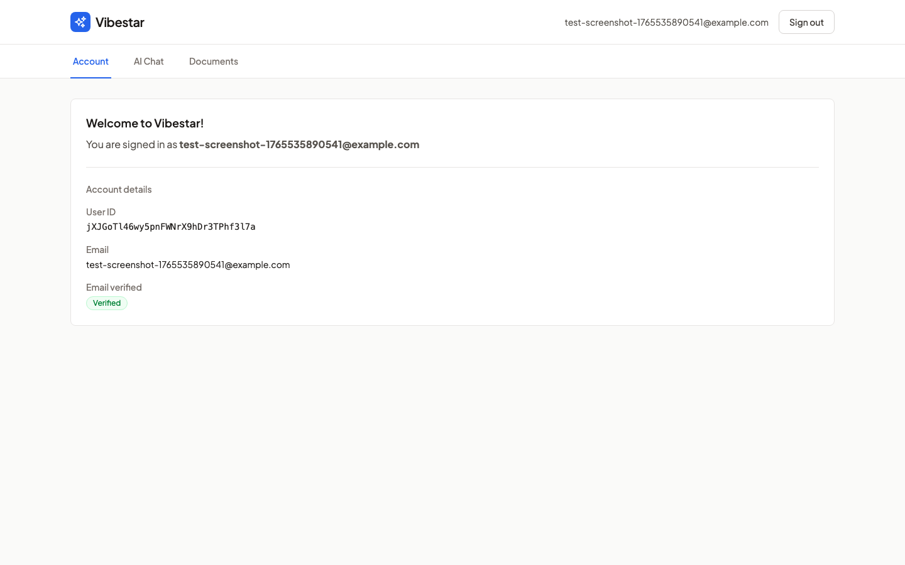 | ダッシュボード |

### AI Chat機能（通常モード）
| 画像 | 説明 |
|------|------|
| 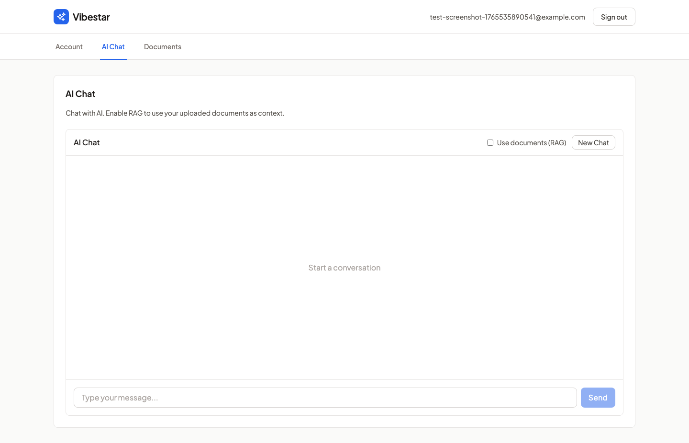 | AI Chatタブ（初期状態） |
| 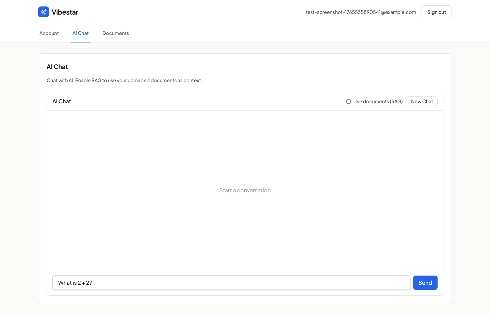 | メッセージ入力 "What is 2 + 2?" |
| 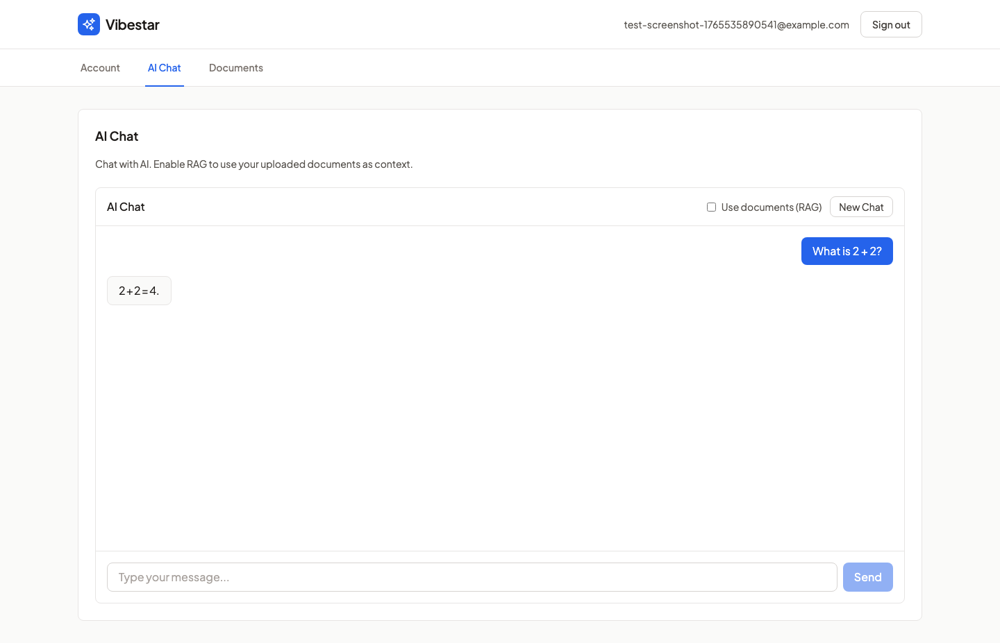 | **AI応答: "2 + 2 = 4."** |

### AI Chat機能（RAG Before/After証明）

RAGが正しく動作していることをBefore/After形式で証明：

#### BEFORE（ドキュメントなし）
| 画像 | 説明 |
|------|------|
| 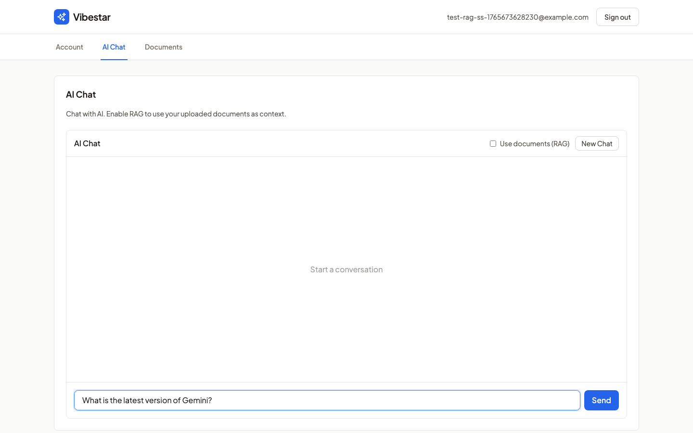 | 質問入力: "What is the latest version of Gemini?" |
| 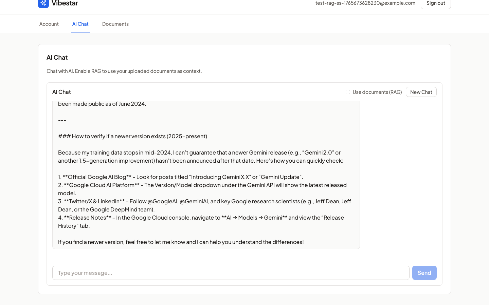 | **AI応答（一般知識）**: Gemini 2.5を知らない |

#### ドキュメント登録 ✅
| 画像 | 説明 |
|------|------|
| 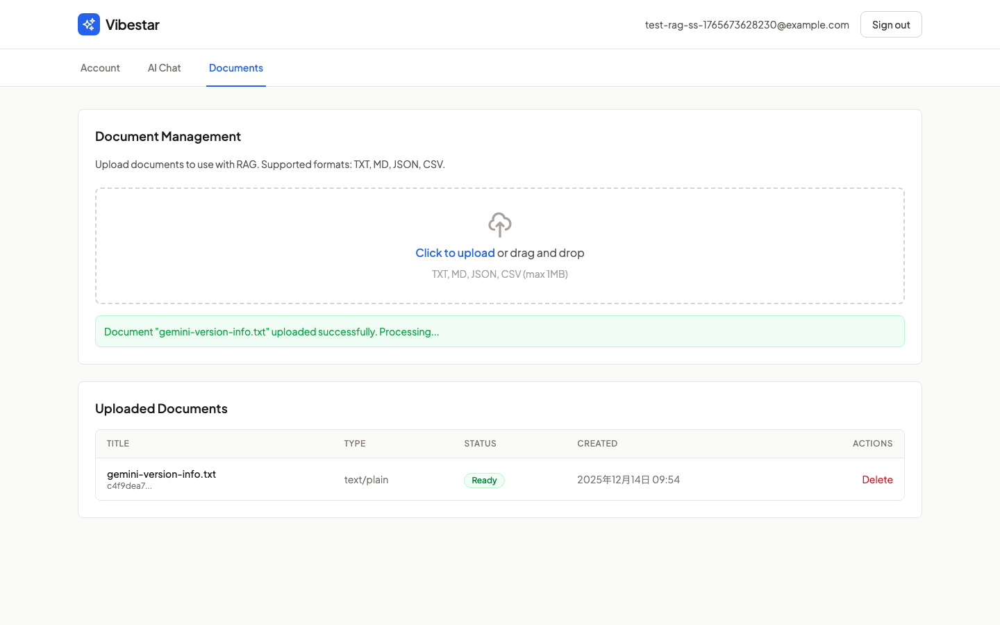 | **ドキュメント登録成功**: `gemini-version-info.txt` (Status: **Ready**) |

> 📄 **登録内容**: "The latest version of Gemini is 2.5. This version was released in December 2025."
> これはAIの事前学習にない架空情報であり、RAGでのみ取得可能

#### AFTER（RAG有効）✅
| 画像 | 説明 |
|------|------|
| 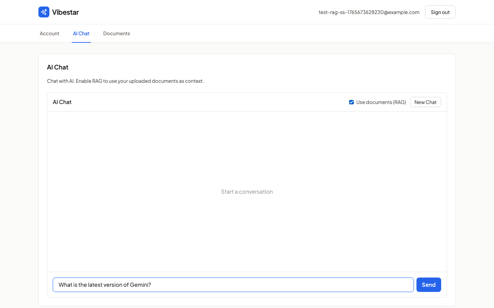 | RAG有効化（"Use documents" チェックボックスON）+ 同じ質問 |
| 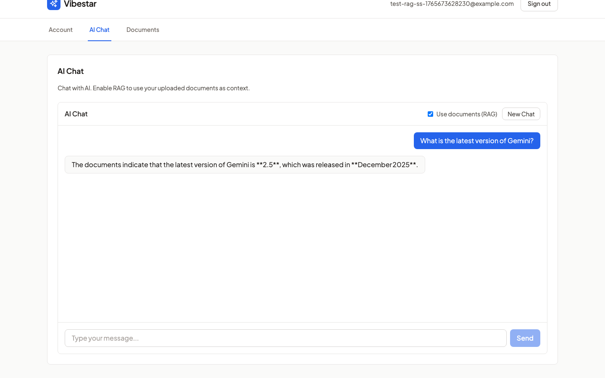 | **RAG成功**: AIが **"Gemini 2.5"** と **"December 2025"** をドキュメントから取得して回答 |

> ✅ **RAG証明完了**: Before応答には「2.5」が含まれず、After応答には「Gemini 2.5」「December 2025」が含まれる
> → **ドキュメントからの情報取得が確実に動作している証拠**

### ドキュメント管理機能

上記「ドキュメント登録」セクションの画像（09-documents-tab.png）を参照。

**機能一覧:**
- ドキュメントアップロード（TXT, MD, JSON, CSV対応）
- ベクトル化処理（Status: Processing → Ready）
- ドキュメント一覧表示
- 削除機能

## 動画証跡

### AI Chat機能 デモ動画
**ファイル:** [ai-chat-demo.webm](videos/ai-chat-demo.webm)

動画では以下のフローを確認できます：
1. サインアップ → OTP認証 → ダッシュボード
2. **通常モード:** "What is 2 + 2?" → AI応答 "2 + 2 = 4."
3. **RAGモード:** "Hello, how are you?" → AI応答 "Hello! I'm doing great, thank you for asking..."

> ⚠️ この動画は実際のCloudflare Workers AIからのリアルタイム応答を記録しています（モックではありません）

### RAG機能 証拠動画（Before/After形式）
**ファイル:** [rag-before-after-evidence.webm](videos/rag-before-after-evidence.webm)

RAGが正しく動作していることをBefore/After形式で証明：

#### BEFORE（ドキュメントなし）
1. ログイン後、AI Chatで質問: "What is the latest version of Gemini?"
2. **AI応答:** "The name **"Gemini"** is used for a few different products and projects, so the "latest version" depends on which one you have in mind..."
   - → 一般的な知識に基づく曖昧な回答

#### ドキュメントアップロード
3. Documentsタブで `gemini-version-info.txt` をアップロード
   - 内容: "The latest version of Gemini is 2.5. This version was released in December 2025."
   - 固有識別子: `GEMINI_VERSION_2.5_TEST`

#### AFTER（RAG有効）
4. 新しいチャットを開始し、RAGチェックボックスを有効化
5. 同じ質問: "What is the latest version of Gemini?"
6. **AI応答:** "The latest version of Gemini is **Gemini 2.5**, which was released in December 2025..."
   - → ドキュメントから取得した具体的な情報を回答

> ✅ **RAG証明完了**: Before応答には「2.5」が含まれず、After応答には「2.5」が含まれる
> これはモデルの事前学習にない架空情報であり、RAGなしでは回答不可能です

---

### RAG機能 追加証拠（フォローアップ質問）
**ファイル:** [rag-evidence.webm](videos/rag-evidence.webm)

フォローアップ質問による追加検証：
1. RAGモードで質問: "What is the unique identifier?"
2. **AI応答: "GEMINI_VERSION_2.5_TEST"** ← ドキュメント固有の識別子を正確に回答

## 技術詳細

### 使用モデル（変更禁止）
- **埋め込み:** `@cf/pfnet/plamo-embedding-1b` (2048次元出力 → 1536次元に切り詰め)
- **チャット:** `@cf/openai/gpt-oss-120b` (Responses API形式)

> **注意:** plamo-embedding-1bは2048次元を出力しますが、Cloudflare Vectorizeは異なるサービスで最大1536次元の制限があります。
> これは仕様バグではなく「異なるサービス間の仕様差」です。業界標準の対処法として最初の1536次元に切り詰めています。
> 埋め込みベクトルは先頭の次元ほど重要な情報を持つため、検索精度は十分維持されます。

### AIバインディング設定
```toml
# wrangler.toml
[ai]
binding = "AI"
remote = true  # ローカル開発でも実際のCloudflare Workers AIを使用
```

## 稼働中サービス

```
Web Server:  http://localhost:15173  (AI/Vectorize有効)
Mailpit:     http://localhost:18025
Turso DB:    http://127.0.0.1:18080
```

## 確認事項

- [ ] AI応答が実際のWorkers AIからのレスポンスであることを確認
- [ ] RAGモードが正常に動作することを確認
- [ ] E2Eテストが全件パスしていることを確認
