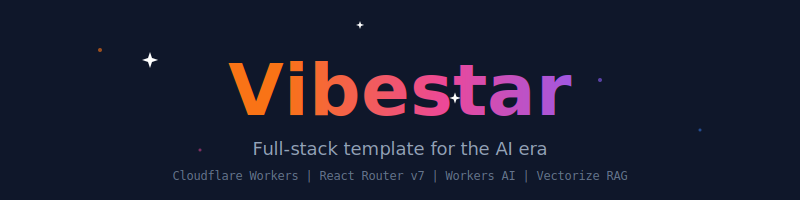
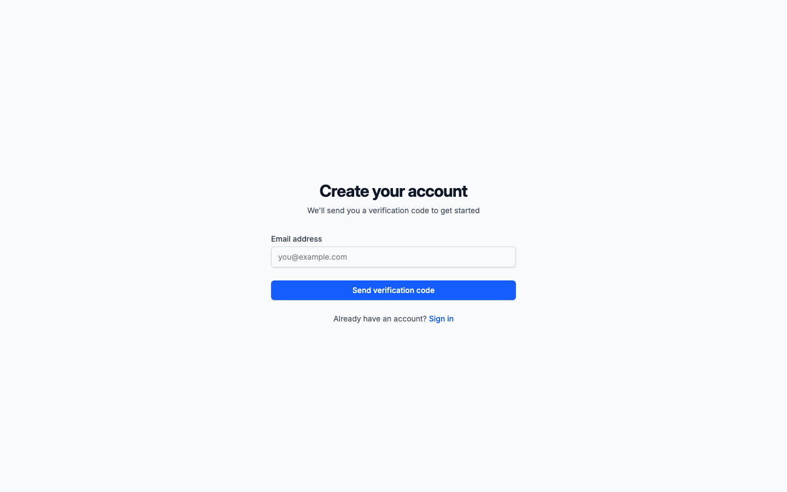
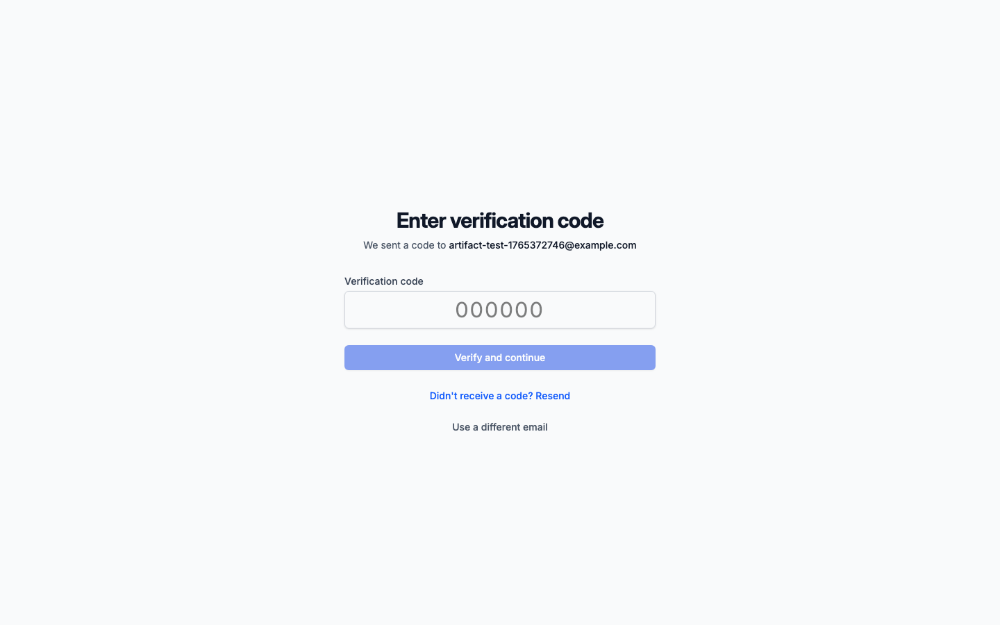
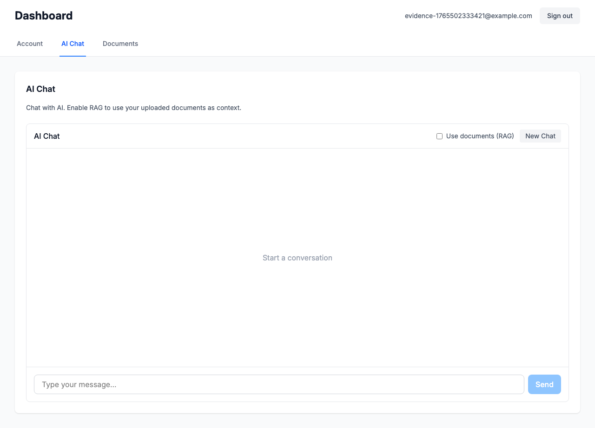
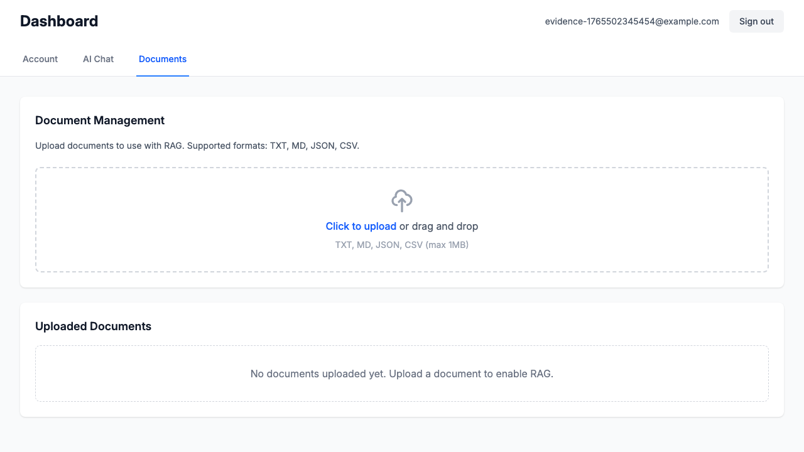
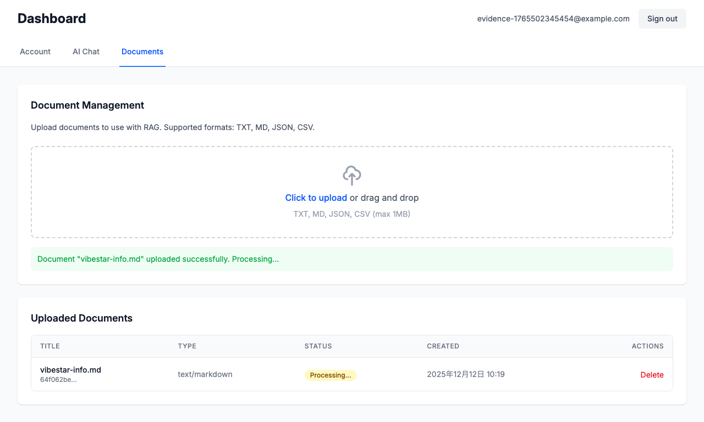

<p align="center">
  <a href="https://github.com/kazuph/vibestar">
    
  </a>
</p>

<p align="center">
  <a href="#features">Features</a> •
  <a href="#quick-start">Quick Start</a> •
  <a href="#tech-stack">Tech Stack</a> •
  <a href="#project-structure">Structure</a> •
  <a href="#development">Development</a> •
  <a href="#deployment">Deployment</a>
</p>

---

**Vibestar** is a production-ready full-stack template optimized for the AI era. Build modern web applications with integrated AI capabilities, powered entirely by the Cloudflare ecosystem.

## Features

- 🔐 **Email OTP Authentication** — Secure passwordless login via Better Auth with automatic user registration
- 💬 **AI Chat with Streaming** — Real-time conversational AI using Workers AI (gpt-oss-120b)
- 📚 **RAG Document Search** — Upload documents and query them with Vectorize embeddings (plamo-embedding-1b)
- ⚡ **Edge-Native Performance** — Runs on Cloudflare Workers globally with sub-100ms latency
- 🧪 **E2E Tested** — Comprehensive Playwright tests with zero mocking, real database, real email delivery

## Screenshots

<table>
  <tr>
    <td align="center">
      <br />
      <sub><b>Sign Up</b></sub>
    </td>
    <td align="center">
      <br />
      <sub><b>OTP Verification</b></sub>
    </td>
    <td align="center">
      <br />
      <sub><b>Dashboard</b></sub>
    </td>
  </tr>
  <tr>
    <td align="center">
      <br />
      <sub><b>AI Chat</b></sub>
    </td>
    <td align="center">
      <br />
      <sub><b>Document Management</b></sub>
    </td>
    <td align="center">
      <br />
      <sub><b>RAG Document Upload</b></sub>
    </td>
  </tr>
</table>

## Quick Start

```bash
# Clone the repository
git clone https://github.com/kazuph/vibestar.git
cd vibestar

# Install dependencies
pnpm install

# Start local services (database + email)
turso dev --db-file local.db --port 18080 &
mailpit --listen :18025 --smtp :11025 &

# Run migrations
pnpm db:migrate

# Start development server
pnpm dev
```

Open http://localhost:15173 to see the app running.

## Tech Stack

| Category | Technology | Purpose |
|----------|------------|---------|
| **Framework** | React Router v7 + Hono + Vite | Full-stack React with file-based routing |
| **Runtime** | Cloudflare Workers | Edge compute platform |
| **Database** | Turso (LibSQL) / SQLite | SQLite-compatible distributed database |
| **ORM** | Drizzle ORM | Type-safe SQL queries |
| **Auth** | Better Auth | Email OTP authentication |
| **Email** | Resend / Mailpit | Transactional emails |
| **AI Chat** | Workers AI (`gpt-oss-120b`) | Large language model inference |
| **Embeddings** | Workers AI (`plamo-embedding-1b`) | 1024-dimensional text embeddings |
| **Vector DB** | Cloudflare Vectorize | Semantic search and RAG |
| **UI** | shadcn/ui + Tailwind CSS | Modern component library |
| **Testing** | Playwright | End-to-end browser testing |

## Project Structure

```
vibestar/
├── app/
│   ├── routes/                    # File-based routing
│   │   ├── _index.tsx             # Landing page
│   │   ├── auth.signup.tsx        # Sign up
│   │   ├── auth.signin.tsx        # Sign in
│   │   ├── auth.verify-otp.tsx    # OTP verification
│   │   ├── dashboard._index.tsx   # Main dashboard
│   │   ├── api.auth.$.ts          # Better Auth API
│   │   ├── api.chat.ts            # AI chat streaming
│   │   └── api.documents.ts       # Document CRUD
│   ├── components/
│   │   ├── ui/                    # shadcn/ui components
│   │   ├── Chat.tsx               # AI chat interface
│   │   ├── DocumentUpload.tsx     # Drag & drop upload
│   │   └── DocumentsList.tsx      # Document management
│   └── lib/
│       ├── db/
│       │   ├── schema.ts          # Drizzle schema
│       │   └── client.ts          # Database client
│       ├── auth.server.ts         # Better Auth config
│       ├── email.server.ts        # Email service
│       └── ai.server.ts           # Workers AI utilities
├── server/
│   └── index.ts                   # Hono middleware
├── drizzle/                       # Migration files
├── e2e/                           # Playwright tests
├── wrangler.toml                  # Cloudflare config
└── package.json
```

## Development

### Prerequisites

- Node.js 20+
- pnpm 9+
- [Turso CLI](https://docs.turso.tech/cli/installation) for local database
- [Mailpit](https://github.com/axllent/mailpit) for local email testing
- Cloudflare account (for deployment)

### Local Services

```bash
# Database (Turso local dev server)
turso dev --db-file local.db --port 18080

# Email (Mailpit for capturing OTP emails)
mailpit --listen :18025 --smtp :11025
# Web UI: http://localhost:18025
```

### Environment Variables

Create `.dev.vars` for local development:

```env
# Database
DATABASE_URL=http://127.0.0.1:18080

# Auth
BETTER_AUTH_SECRET=your-development-secret-key

# Email (Mailpit for local)
SMTP_HOST=localhost
SMTP_PORT=11025

# Optional: Resend for production
RESEND_API_KEY=re_xxx
```

### Available Scripts

```bash
pnpm dev          # Start dev server with Wrangler
pnpm build        # Build for production
pnpm db:generate  # Generate migrations from schema
pnpm db:migrate   # Run migrations
pnpm test:e2e     # Run Playwright E2E tests
pnpm typecheck    # TypeScript type checking
pnpm lint         # ESLint
```

## Authentication Flow

```
┌─────────────┐     ┌─────────────┐     ┌─────────────┐
│  User       │────▶│  Enter      │────▶│  Receive    │
│  visits     │     │  email      │     │  OTP email  │
│  /signup    │     │  address    │     │             │
└─────────────┘     └─────────────┘     └──────┬──────┘
                                               │
┌─────────────┐     ┌─────────────┐            │
│  Dashboard  │◀────│  Verify     │◀───────────┘
│  access     │     │  6-digit    │
│  granted    │     │  OTP code   │
└─────────────┘     └─────────────┘
```

- New users are automatically registered on first OTP verification
- Session persists via secure HTTP-only cookies

## AI Features

### Chat

The AI chat uses streaming responses for real-time interaction:

```typescript
// POST /api/chat
{
  "message": "What is Vibestar?",
  "useRag": true  // Enable document context
}
```

### RAG (Retrieval-Augmented Generation)

1. Upload documents via the dashboard
2. Documents are chunked and embedded using `plamo-embedding-1b`
3. Vectors stored in Cloudflare Vectorize
4. Chat queries retrieve relevant context automatically

## Deployment

### Cloudflare Dashboard Setup

1. Create a Vectorize index:
```bash
npx wrangler vectorize create vibestar-docs --dimensions=1024 --metric=cosine
```

2. Set production secrets:
```bash
npx wrangler secret put BETTER_AUTH_SECRET
npx wrangler secret put TURSO_DATABASE_URL
npx wrangler secret put TURSO_AUTH_TOKEN
npx wrangler secret put RESEND_API_KEY
```

3. Deploy:
```bash
pnpm build && npx wrangler deploy
```

### Environment Configuration

Production environment variables (set via Cloudflare Dashboard or `wrangler secret`):

| Variable | Description |
|----------|-------------|
| `BETTER_AUTH_SECRET` | Authentication secret key |
| `TURSO_DATABASE_URL` | Turso database URL (libsql://...) |
| `TURSO_AUTH_TOKEN` | Turso authentication token |
| `RESEND_API_KEY` | Resend API key for emails |

## E2E Testing

Tests run against real services with no mocking:

```bash
# Start required services
turso dev --db-file local.db --port 18080 &
mailpit --listen :18025 --smtp :11025 &

# Run all E2E tests
pnpm test:e2e

# Run specific test file
pnpm exec playwright test e2e/auth.spec.ts

# Run with UI mode
pnpm exec playwright test --ui
```

Test artifacts (screenshots, videos) are saved to `.artifacts/` for debugging.

## License

MIT

---

<p align="center">
  Built with the Cloudflare ecosystem
</p>
